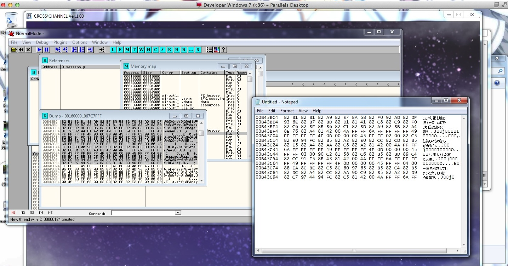
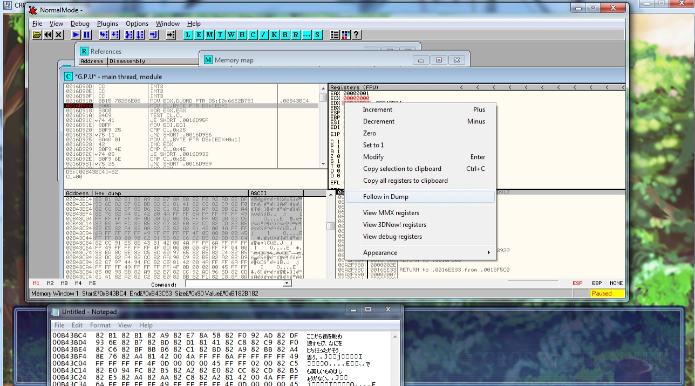

1.文件-附加

2.Alt+B打开【内存映射】【M】

3.Cltr+L搜索

4.在数据【D】复制

寻找特殊码需要的条件：  
\* 熟悉，至少了解，简单的汇编语言。  
\* 下载OllyDbg和以下工具。  
  
一些细节可以参考这里：  
[http://sakuradite.com/topic/528](http://jump.bdimg.com/safecheck/index?url=x+Z5mMbGPAt+kUHjmjtIdg48IRVHhc+hdxK5+3FiHOecKXgeF7KlGX5erfQ768s0CPPa0hS7IZ4OyTrdsImtqwi4mZOwB1fhWZET38kOAGsb8Yd85VHFTYXCYAFoYPHg/RbLNbFpiwN2Pah4egTNMg==)  
  
  
  
【OD官方英文版】odbg v2.01  
【OllyDBG V1.10 汉化版(第二版)】HH_OllyDBG_1.10_second_cao_cong  
【硬盘版】OllyDbg v2.01 alpha1 (简称OD)汇编及分析调试器汉化修正版  
【日文文本互转十六进制码】hex-sjis-converter_2008_03_05  
【记录卡住部分的汇编代码】 notepad++ npp.4.3.bin  
  
  
百度日文手写输入独立版：  
（对完全不懂日文，用来手写查找文本时用）  
  
在線日文手寫  
  
  
在线日文文本互转十六进制码工具：  
无需翻墙：  
[http://takashiki.herokuapp.com/index.php?url=1j1E16yv1F1H1I17yC1pyNynyVyiyC0TydyX1w1k1D1JyG161syG0WyL1q1vyZ1tyb0e0H0Z161eyK1C](http://jump.bdimg.com/safecheck/index?url=x+Z5mMbGPAs2kwK0E11EX4KD9XYRy5cHTSpGGIZet0HE0+sJkzUJU1TNM1QJ1E4TQMLcTVlPsbUFGJBlt+siMxWHc+676oogo65Gu4GvWUoi8zc0Oa74/NgT6uJJzV3tAEyUOsfMUKiQHM677AHNnVvZyTdQZ8DOf83cYl9kUK1MnfR/9r3jeV1N6XIMkOCcaBcPS0joVr6oXRX1Kk6a0f9cF0R0KlMqBYjCmszzWpvuXlDJ38omlZp2kwtJUkIWdDYRB/U+39vnSFH+BirmFDywTd7xQSt9yMUGog18LJ9V92TAmoWV0zA8Zu4mdgY0)  
[http://takashiki.herokuapp.com/index.php?url=1j1E16yvyD1a1B1rye16yQ1s0VyjyIyc0TyPyV1F1F1cyh1610yMyQ0S1v1qyVyZyYyH0H0ayA1gyK1Iyl](http://jump.bdimg.com/safecheck/index?url=x+Z5mMbGPAs2kwK0E11EX4KD9XYRy5cHTSpGGIZet0HE0+sJkzUJU1TNM1QJ1E4TQMLcTVlPsbUFGJBlt+siMx1/RZPlVIIOAWM4meT3cB8v/Pyinjx6Cq3nUHE2Sm5Q0kgInm6uhqVx1YoG2mHJhbcWx41tj1mjJJkMlGcxszpVf8FglUAQy1FCQdhZ4adGFwM1tVRDD1MUbasaXYoEMBEdjaJxIM59ZV9YHuGyeJ8I89rSFLshng7JOt2wia2rCLiZk7AHV+FZkRPfyQ4Aaxvxh3zlUcVNhcJgAWhg8eD9Fss1sWmLA3Y9qHh6BM0y)  
  
  
需翻墙：  
[http://freaka.freehostia.com/charset.php](http://jump.bdimg.com/safecheck/index?url=x+Z5mMbGPAtJEkaVYe2V8BLx6dwbfzZIvJv0iCMfLGxd/JcErjW6NGN0td5OoMRVJiWf/AYBvOAFiMKazPNam+5eUMnfyiaVmnaTC0lSQhZ0NhEH9T7f2+dIUf4GKuYUPLBN3vFBK33IxQaiDXwsn1X3ZMCahZXTMDxm7iZ2BjQ=)  
[http://freaka.freehostia.com/charset2.php](http://jump.bdimg.com/safecheck/index?url=x+Z5mMbGPAtJEkaVYe2V8BLx6dwbfzZIvJv0iCMfLGxd/JcErjW6NGN0td5OoMRVKYpxCLck2lcFiMKazPNam+5eUMnfyiaVmnaTC0lSQhZ0NhEH9T7f2+dIUf4GKuYUPLBN3vFBK33IxQaiDXwsn1X3ZMCahZXTMDxm7iZ2BjQ=)  
  
  
  
步骤一：  
首先，在日区下打开游戏，直到看到游戏文本。  
然后打开OllyDbg，在菜单中选择File =\> Attach，在弹出的程序列表中找到Cross
Channel，并attach到上边。  
之后执行OllyDbg菜单中的Debug=\>Run。  
  
如果你有虚拟机，可以在这时创建一个snapshot。  
  
  
  
补充：  
  
汉化版OD菜单操作，希望对更多人提取特殊码有所帮助。  
英文版  
【File--\>Attach】  
汉化版  
菜单栏的【文件】——【附加】选择（游戏进程名.exe）——【附加】。  
  
  
  
  
  
步骤二：  
  
点击一下游戏窗口，看到游戏文字，然后用日文输入法把文字打下来，比方说：「ここから街」  
然后用你知道的方法来计算这个文字的在特定编码下hex。  
我自己是写了一个Python的脚本hexstr来算的。比方说：  
  
[pre]% hexstr ここから街を
sjis82b182b182a982e78a5882f0[/pre]我通常会计算这个字符串在四个编码下的hex：SHIFT-JIS,
UTF16, UTF16 Big Endian，UTF8。  
  
主流的语言（Python、Ruby、Java，etc）都是内置文本文字编码转换的api的。  
如果你熟悉编程，你可以选择一个你熟悉的语言来写一个10行左右的生成特定文字编码的hex的程式。  
如果你并不熟悉编程，那么只好google一些可以免费做文字编码变换的网站。  
  
  
  
  
  
  
  
  
步骤三：  
如果你有安装虚拟机，revert到之前保存的snapshot。  
如果没有的话，可以回到title，重新进入游戏，直到出现「ここから街」之前。  
这时，用OllyDbg在memory里搜索那串SHIFT-JIS编码的hex。  
  
用OllyDbg在内存搜索hex的方法很简单：  
1. Alt+M打开内存窗口  
2. Ctrl+B打开搜索窗口  
3. 把hex输入进去  
4. 点击搜索。  
5. Ctrl+G搜索下一个。直到找到在内存中的全部的match。  
  
另外，由于OllyDbg本身并不支持日文编码，看不到内存中文字的内容。  
如果你在运行的是日文版的Windows，那么可以将内存中的乱码复制到Notepad或者Vim之类的工具中，然后就可以看到日文的字符了（参看截图）。  
  
如果搜索不到SHIFT-JIS编码的hex，可以改为搜索UTF16或者UTF8编码的hex。  
  
如果各种编码都所不到，只好点击游戏的窗口，直到出现「ここから街」之后。  
然后再次搜索各种编码的hex。  
  
如果这样还是找不到文本，可以尝试去bottom-up traverse call graph of GDI
functions。  
这个方法和Cross Channel无关，这里就不细说了。  
  
  

  
  
注：若Ctrl+G搜索不对，就是Ctrl+L来搜索。  
补充： OD英文版v2.01和汉化版v2.21可以直接搜索后【Shift+F5】添加断点。  
  
  
  
  
  
步骤四：  
在找到游戏的文本在内存中的位置后，可以右键点击文字的起始位置，并选择：  
Breakpoint =\> Hardware, on access =\> Byte  
来插入断点。  
  
如果不小心插错了，可以在OllyDbg的菜单中，选择Debug =\> Hardware
breakpoints，然后删掉插错的断点。  
  
  
  
补充：  
OD英文版  
【Breakpoint--\>Hardware,on access--\>OK】或快捷键【Shift+F5】添加。  
  
OD汉化版v1.10  
【断点→→硬件断点→→地址（R/W）→→字节→→确定】  
  
OD汉化版v2.21  
【断点--\>硬盘访问--\>字节】或快捷键【Shift+F5】添加。  
  
这样就设置了一个断点。断点就像做记号一样，它会在程序运行到这个地方时就暂停下来，让你看清楚发生了什么。  
  
OD汉化版v1.10  
【菜单栏--\>调试（D）——硬件断点（H）】  
  
OD汉化版v2.21  
注：可以在【菜单栏--\>查看--\>硬件断点】或快捷键【Alt+H】里看到所设置的断点。在设置断点前请保证这里是清空的。  
  
  
  
  
  
步骤五：  
在插入断点后，运行下游戏，那么游戏应该被OllyDbg卡住。  
如果没有卡住，说明插入的断点没有起到作用。这时，就不能用这种方法来找特殊码了。  
按下F9后，可以让游戏继续运行而不再卡住。  
  
在游戏卡住后，会出现卡住位置的汇编代码。  
建议用文本工具（比如Vim，Notepad++之类的），将全部卡住部分的汇编代码以及卡住的都记录下来。  
比方说，Cross Channel会卡住三处。汇编代码如下：  
  
代码1：（看起来，这段代码是一个C++11 lambda函数的开始）  
0016D90E CC INT3

0016D90F CC INT3

0016D910 8B15 782B6E06 MOV EDX,DWORD PTR DS:[0x66E2B78] ; .00B43BFE

0016D916 8A0A MOV CL,BYTE PTR DS:[EDX] ; jichi: 卡在这里，只能提取scenario

0016D918 33C0 XOR EAX,EAX

0016D91A 84C9 TEST CL,CL

0016D91C 74 41 JE SHORT .0016D95F

代码2：  
001E9B10 8B75 FC MOV ESI,DWORD PTR SS:[EBP-0x4]001E9B13 EB 0D JMP SHORT
.001E9B22

001E9B15 8A10 MOV DL,BYTE PTR DS:[EAX] ; jichi:
卡在这里，可以提取全部文本，但是有垃圾

001E9B17 84D2 TEST DL,DL

001E9B19 74 11 JE SHORT .001E9B2C

代码3：

001E9B2A C9 LEAVE

001E9B2B C3 RETN

001E9B2C 0FB600 MOVZX EAX,BYTE PTR DS:[EAX] ; jichi: 卡在这里

001E9B2F 0FB609 MOVZX ECX,BYTE PTR DS:[ECX]001E9B32 2BC1 SUB EAX,ECX

步骤六：  
在找到汇编代码后，卡住的位置就是可能的hook的地址。  
如果有使用虚拟机，可以revert到之前的snapshot。  
如果没有虚拟机，可以在OllyDbg的菜单中，Debug =\> Hardware
Breakpoints，删掉刚刚插入的调试位置。  
  
在Cross Channel中卡住的位置一共有三处，选择一处你看着顺眼的就好了。  
比方说，VNR中的5pb游戏引擎有两个hook：5pb1和5pb2.  
其中，5pb1就是hook到了代码1中的卡住的位置。  
而5pb2就是hook到了代码2中的卡住的位置。  
  
比方说，我要选择了第一个卡住的位置来插入特殊码。  
首先，选择卡住的位置，然后按下F2，那一行就会变红。  
这时，再执行下游戏，游戏就会再次卡在F2的那个地方。  
  
  
  
  
步骤七：  
在游戏卡住后，通过分析游戏卡住时的行为，就可以设计出特殊码了。  
比方说，下边是Cross Channel第一次卡住时的汇编代码：  
[pre]mov cl,byte ptr
ds:[edx][/pre]这里是在把[edx]寄存器的数据复制到ecx寄存器的低位中，并且只复制一个byte。  
所以，游戏的文本很可能就在edx中。  
  
为了确定游戏的文本是不是在edx，可以如截图中，右键点击右边寄存器窗口中的edx，选择Follow
in Dump。  
之后，在左下边的内存窗口中，就会出现文本了。  
由于OllyDbg不支持显示日文，可以同样将内存直接复制到Notepad里，就可以看到内存中的日文文本了。  
  
如果没有出现文本，说明可能不应该hook在这里，或者hook到的文本有垃圾，或者文本不在edx中。  
  
在下边的截图中，Notepad显示edx中的文本正是我们想要的「ここから街を」。  
  
  

  
步骤八：最后，把上边这些信息综合起来，就可以生成特殊码了。  
我们知道的信息如下：  
\* 我们让游戏卡住的位置是：0x0016D916  
\* 游戏文本hex时用的编码是SHIFT-JIS  
\* 游戏卡住后吧，文本在[edx]中  
  
然后把着三个信息何在一起，就可以得到特殊码：/HS-C\@16D916（不要把这个特殊码添加到游戏中，因为VNR已经支持从Cross
Channel提取文本了）  
这里：  
\* \@16D916是hook的位置。  
\* S表示使用SHIFT-JIS或者UTF-8。如果是W，表示使用UTF16编码。  
\* -C表示从[edx]读取文本。  
  
这里的-C其实是寄存器在pushad指令后，edx的偏移量。  
如果是其他的游戏，文本不在edx，而在，比如eax中，那么这个值就不同了。  
作为参考，这个值对应的含义如下（其实就是执行hook函数时栈的结构）：  
  
  
...  
10: arg4，如果hook的是函数，第4个参数的位置  
c: arg3，如果hook的是函数，第3个参数的位置  
8: arg2，如果hook的是函数，第2个参数的位置  
4: arg1，如果hook的是函数，第1个参数的位置  
0: retaddr，hook返回的地址  
-4: eax，pushad的偏移量  
-8: ecx，pushad的偏移量  
-c: edx ，pushad的偏移量  
-10: ebx，pushad的偏移量  
-14: esp，pushad的偏移量  
-18: ebp，pushad的偏移量  
-1c: esi，pushad的偏移量  
-20: edi，pushad的偏移量
